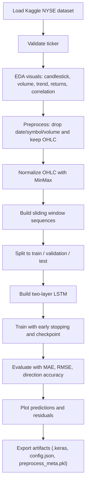
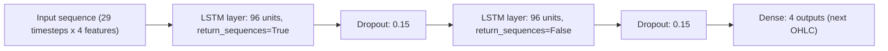
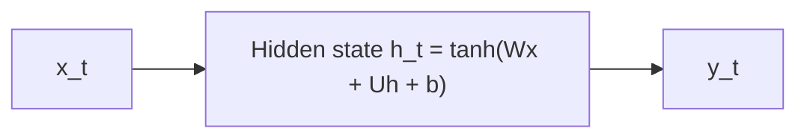
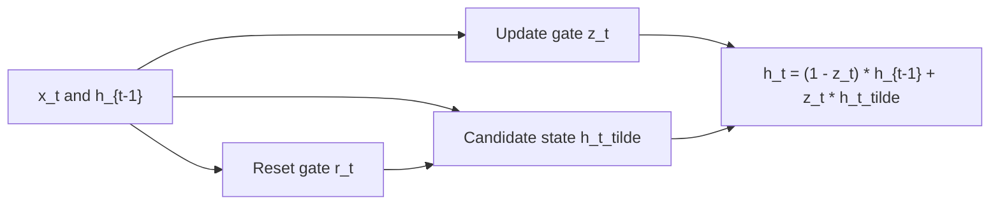
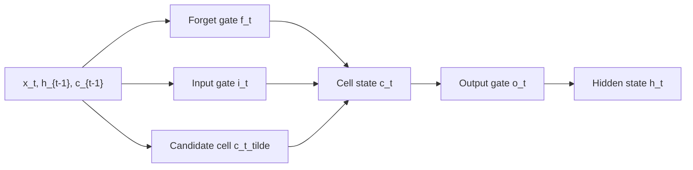

# NYSE LSTM Forecasting (Kaggle Ready)

This repository contains **one notebook**:
- `nyse-stock-forecasting-fresh-flow.ipynb`

The notebook builds an end-to-end LSTM forecasting pipeline for NYSE stock OHLC data, with clean visual analysis, preprocessing checks, training diagnostics, and deployment artifacts.

## Dataset

This notebook uses the Kaggle NYSE dataset:
- Dataset: **dgawlik/nyse**
- Kaggle path used in notebook: `/kaggle/input/datasets/dgawlik/nyse/prices-split-adjusted.csv`
- Kaggle URL: `https://www.kaggle.com/datasets/dgawlik/nyse`

## Ticker Used

Current configured ticker in notebook:
- `TICKER = "EQIX"`

You can change the ticker in the configuration cell and rerun.

## Implementation Flow

## Why This Pipeline

- Stock data is sequential and time-dependent, so recurrent models are natural candidates.
- LSTM is robust for longer dependencies and noisy financial sequences.
- The notebook includes preprocessing verification charts (before vs after normalization) to reduce silent data issues.
- Export artifacts make the notebook usable beyond experimentation (Kaggle working directory output).

## LSTM Architecture Used

From the notebook config:
- Sequence length: `30`
- Input features to model: `OHLC` (`open`, `high`, `low`, `close`)
- LSTM layers: `2`
- Units per LSTM layer: `96`
- Dropout: `0.15` after each LSTM layer
- Output: `Dense(4)` for next-step OHLC prediction
- Loss: `MSE`
- Optimizer: `Adam(learning_rate=0.001)`
- Train setup: `batch_size=64`, `epochs=40`, with early stopping

## RNN vs GRU vs LSTM (Architecture View)

### Vanilla RNN (conceptual)

- Pros: simple, fast, fewer parameters.
- Limitation: struggles with long-term dependencies (vanishing gradients).

### GRU (conceptual)

- Pros: faster than LSTM, fewer gates/parameters.
- Limitation: less explicit memory control than LSTM in some long-horizon patterns.

### LSTM (conceptual)

- Pros: explicit cell state + gates, generally strong for long/complex temporal dependencies.
- Tradeoff: heavier than GRU/RNN.

## Why LSTM Is Preferred Here

For this notebook?s objective (stable next-step OHLC forecasting on noisy market data), LSTM is a practical default because:
- it preserves useful context over longer spans better than vanilla RNN,
- it is typically more stable on non-stationary sequence behavior,
- it aligns well with the notebook?s sequence-window design and evaluation setup.

Note: this notebook currently implements **LSTM only**. The RNN/GRU comparison above is architectural reasoning. For strict empirical comparison, train all three under identical splits/hyperparameters.

## Kaggle Run Steps

1. Open `nyse-stock-forecasting-fresh-flow.ipynb` in Kaggle.
2. Ensure the dataset `dgawlik/nyse` is attached.
3. Run all cells top-to-bottom.
4. Review metrics/plots.
5. Collect exported artifacts from `/kaggle/working/nyse_lstm_artifacts`.

## Deployment Artifacts Produced

- `nyse_lstm_ohlc.keras` (final model)
- `best_lstm.keras` (best checkpoint)
- `config.json` (run configuration)
- `preprocess_meta.pkl` (preprocessing metadata)

## Notes

- Keep preprocessing consistent between training and inference.
- If you change feature engineering, retrain and regenerate artifacts.
