# NYSE Stock Forecasting with LSTM

<p align="center">
  
  
  
  
  
</p>

---

## 🚀 Project Overview

This repository features a **comprehensive, end-to-end LSTM pipeline** designed for forecasting New York Stock Exchange (NYSE) data. It is specifically optimized for Kaggle environments, providing a seamless flow from raw data ingestion to production-ready model artifacts.

### 🎯 Key Highlights
- **End-to-End Workflow**: Covers data validation, EDA, preprocessing, training, and artifact export.
- **Interactive EDA**: Utilizes `Plotly` for high-quality, interactive financial visualizations.
- **Robust Preprocessing**: Implements sliding window sequence construction with automated MinMax normalization.
- **Deep Learning Architecture**: Features a stacked two-layer LSTM model with dropout regularization for time-series stability.
- **Production Ready**: Automatically exports model checkpoints, scalars, and metadata for immediate deployment.

---

## 📊 Implementation Flow

The pipeline follows a rigorous data science lifecycle to ensure model reliability and performance:


### 1. Exploratory Data Analysis (EDA)
The notebook generates deep insights using:
- **Candlestick Charts**: Visualizing price action and volume distribution.
- **Moving Averages**: Analyzing trends with 20-day and 60-day window averages.
- **Return Analysis**: Histograms of daily returns to understand market volatility.
- **Feature Correlation**: Heatmaps identifying relationships between OHLC (Open, High, Low, Close) features.


### 2. Neural Architecture with Stacked LSTM
The model utilizes a **Stacked LSTM** architecture, designed to process sequential data with multiple levels of abstraction. 

The architecture consists of:
- **Input Channels**: 5 distinct market indicators (Open, High, Low, Close, Volume).
- **Layer Stacking**: Two sequential LSTM layers to extract both short-term volatility and long-term trends.
- **Output**: A single regression output predicting the next trading day's closing price.

```mermaid
graph TD

    %% ── Row Labels (left-anchors) ──
    LI["Input Layer\n(30, 5)"]
    L1["LSTM Layer 1\n96 Units\nreturn_seq=True\nOut: (30,96)"]
    L2["LSTM Layer 2\n96 Units\nreturn_seq=False\nOut: (96,)"]
    LD["Dense Layer\n25 Neurons | ReLU\nOut: (25,)"]
    LO["Output Layer\n1 Neuron | Linear\nOut: (1,)"]

    %% ── Input timesteps ──
    X1["X₁\nDay 1"] --> X2["X₂\nDay 2"] --> X3["X₃\nDay 3"] --> Xd(("...")) --> XN["X₃₀\nDay 30"]

    %% ── LSTM 1 timesteps ──
    H11(("h¹₁")) --> H12(("h¹₂")) --> H13(("h¹₃")) --> H1d(("...")) --> H1N(("h¹₃₀"))

    %% ── LSTM 2 timesteps ──
    H21(("h²₁")) --> H22(("h²₂")) --> H23(("h²₃")) --> H2d(("...")) --> H2N(("h²₃₀"))

    %% ── Dense neurons ──
    D1(("d₁")) --- D2(("d₂")) --- D3(("d₃")) --- Dd(("...")) --- D25(("d₂₅"))

    %% ── Output ──
    PRED(["Predicted Close Price"])

    %% ── Vertical column connections ──
    X1  --> H11
    X2  --> H12
    X3  --> H13
    XN  --> H1N

    H11 --> H21
    H12 --> H22
    H13 --> H23
    H1N --> H2N

    H2N --> D1
    H2N --> D2
    H2N --> D3
    H2N --> D25

    D1  --> PRED
    D2  --> PRED
    D3  --> PRED
    D25 --> PRED

    %% ── Row label connections (invisible, for alignment) ──
    LI ~~~ X1
    L1 ~~~ H11
    L2 ~~~ H21
    LD ~~~ D1
    LO ~~~ PRED

    %% ── Styling ──
    style LI fill:#fafaf5,stroke:#bdbdbd,stroke-width:1px,color:#616161
    style L1 fill:#fafaf5,stroke:#bdbdbd,stroke-width:1px,color:#616161
    style L2 fill:#fafaf5,stroke:#bdbdbd,stroke-width:1px,color:#616161
    style LD fill:#fafaf5,stroke:#bdbdbd,stroke-width:1px,color:#616161
    style LO fill:#fafaf5,stroke:#bdbdbd,stroke-width:1px,color:#616161

    classDef inputBox  fill:#f5f5f0,stroke:#9e9e9e,stroke-width:2px,color:#37474f,font-size:14px
    classDef lstm1Node fill:#dde3e8,stroke:#78909c,stroke-width:2px,color:#263238,font-size:16px
    classDef lstm2Node fill:#cfd6dc,stroke:#546e7a,stroke-width:2px,color:#263238,font-size:16px
    classDef denseNode fill:#e8e8e3,stroke:#9e9e9e,stroke-width:2px,color:#37474f,font-size:16px
    classDef outNode   fill:#f1f8e9,stroke:#7cb342,stroke-width:2.5px,color:#1b5e20,font-size:15px
    classDef dotNode   fill:#fafafa,stroke:#e0e0e0,stroke-width:1px,color:#bdbdbd,font-size:18px

    class X1,X2,X3,XN inputBox
    class H11,H12,H13,H1N lstm1Node
    class H21,H22,H23,H2N lstm2Node
    class D1,D2,D3,D25 denseNode
    class PRED outNode
    class Xd,H1d,H2d,Dd,H2d dotNode


```




| Hyperparameter | Value |
| :--- | :--- |
| **Lookback Window** | 29 Days |
| **LSTM Units** | 96 per layer |
| **Dropout Rate** | 0.15 |
| **Loss Function** | Mean Squared Error (MSE) |
| **Optimizer** | Adam (LR: 0.001) |
| **Batch Size** | 64 |
| **Features** | 4 (Open, High, Low, Close) |

---

## 🛠️ Getting Started

### Prerequisites
- Python 3.8+
- TensorFlow 2.x
- Pandas, NumPy, Scikit-learn, Plotly

### Dataset
This project uses the **Kaggle NYSE Dataset**:
- **Dataset ID**: `dgawlik/nyse`
- **Path**: `/kaggle/input/datasets/dgawlik/nyse/prices-split-adjusted.csv`

### How to Run
1.  Upload `nyse-stock-forecasting-fresh-flow.ipynb` to a Kaggle Notebook.
2.  Add the `dgawlik/nyse` dataset to your environment.
3.  (Optional) Modify the `TICKER` variable in the Configuration cell to forecast a specific stock (Default: `EQIX`).
4.  Execute all cells.

---

## 📦 Deployment & Artifacts

Upon completion, the pipeline exports all necessary components to `/kaggle/working/nyse_lstm_artifacts`:

| Artifact | Purpose |
| :--- | :--- |
| `nyse_lstm_ohlc.keras` | The final trained model file. |
| `best_lstm.keras` | The best performing checkpoint (lowest validation loss). |
| `config.json` | Stores hyperparameters and feature mapping. |
| `preprocess_meta.pkl` | Crucial metadata for inverse scaling and inference consistency. |

### Inference Snippet
```python
# Quick example of how to use the saved model
from tensorflow.keras.models import load_model
model = load_model('nyse_lstm_ohlc.keras')
prediction = model.predict(normalized_input_window)
```

---

## 🔬 Experimental Comparison (RNN vs GRU vs LSTM)

While this project defaults to LSTM for its stability with long-term dependencies, here is a conceptual breakdown of why it was chosen:

- **Vanilla RNN**: Simple and fast, but prone to **Vanishing Gradients** in longer sequences.
- **GRU (Gated Recurrent Unit)**: Efficient and often faster than LSTM; great for medium-length patterns.
- **LSTM (Long Short-Term Memory)**: Includes an explicit "Cell State" for fine-grained memory control, making it the most robust for volatile stock sequences.

---

<p align="center">
  <i>Developed for professional-grade stock forecasting and deployment research.</i>
</p>
